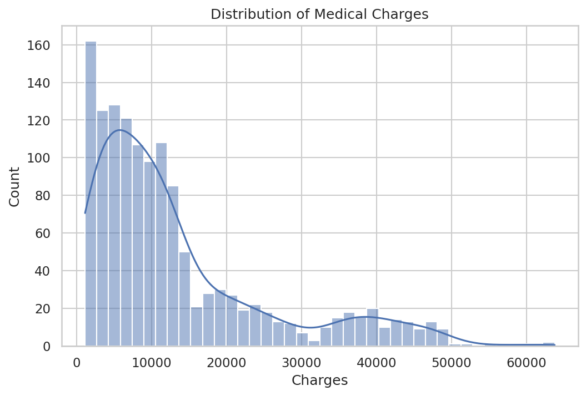
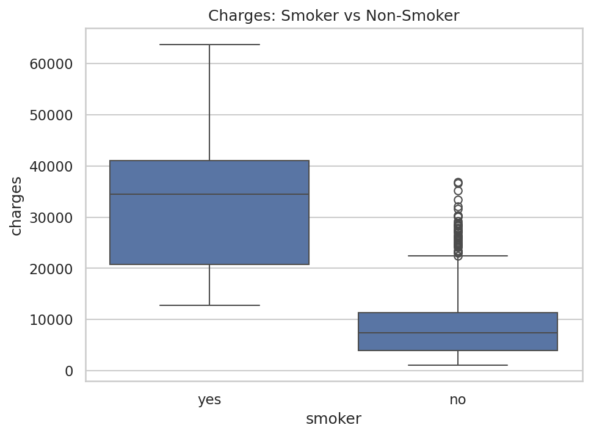
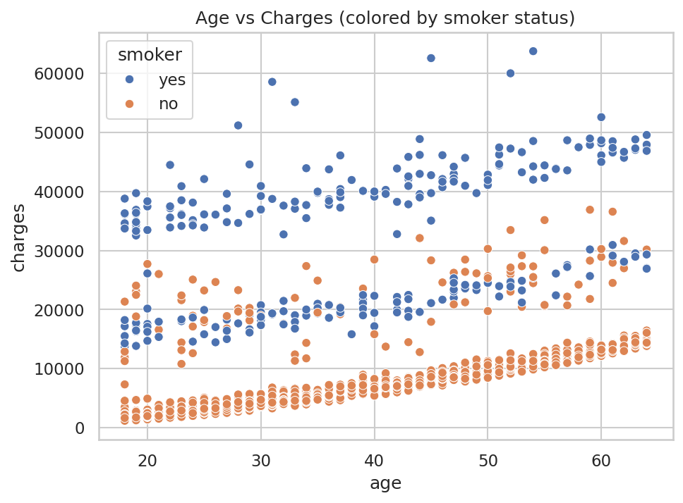
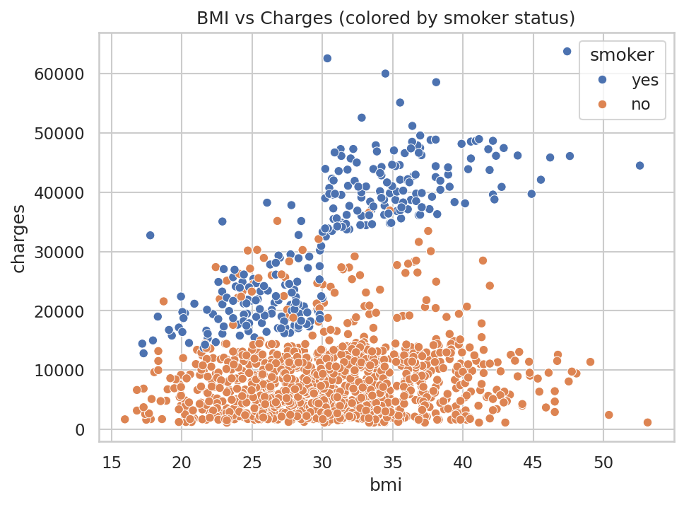
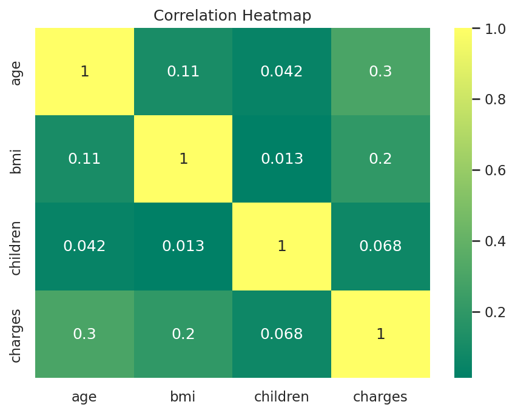
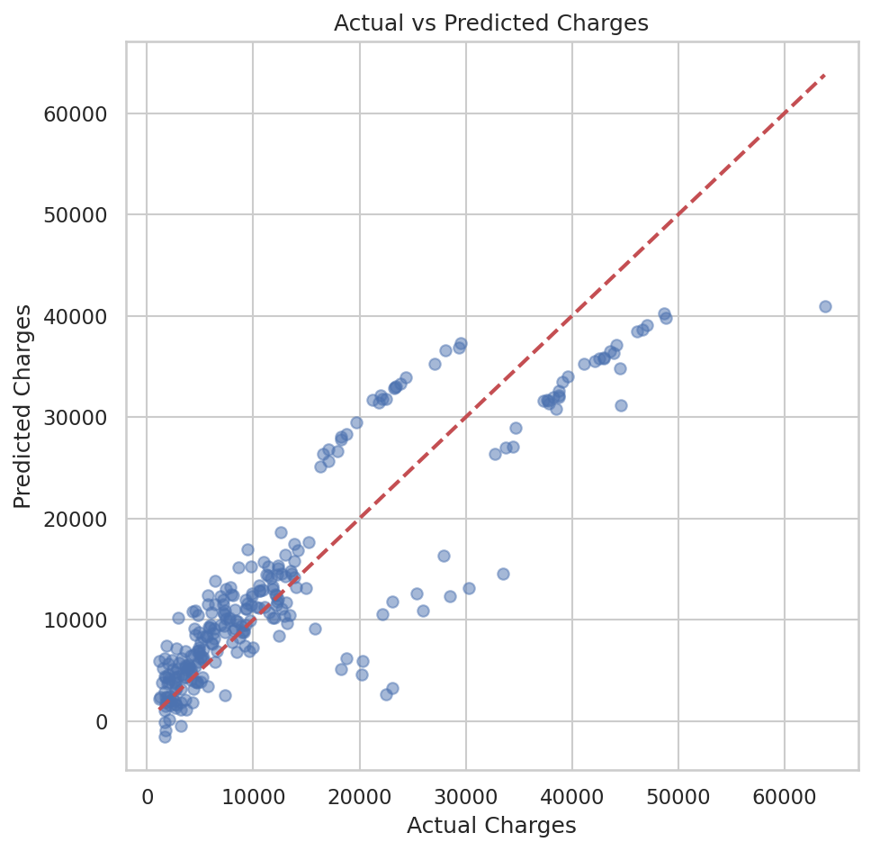
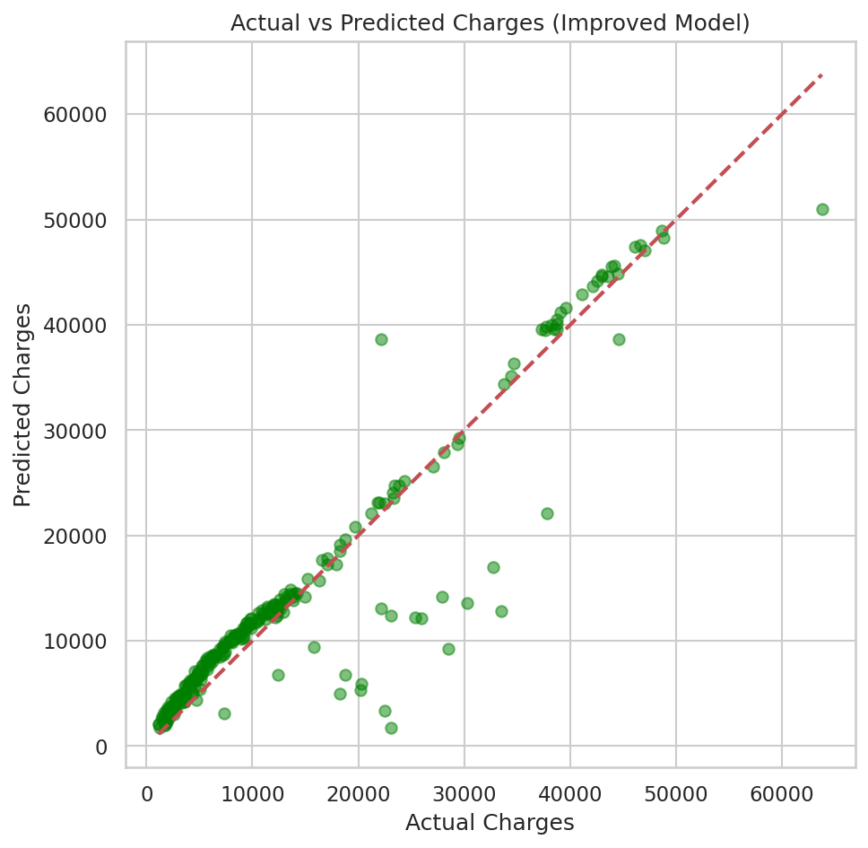
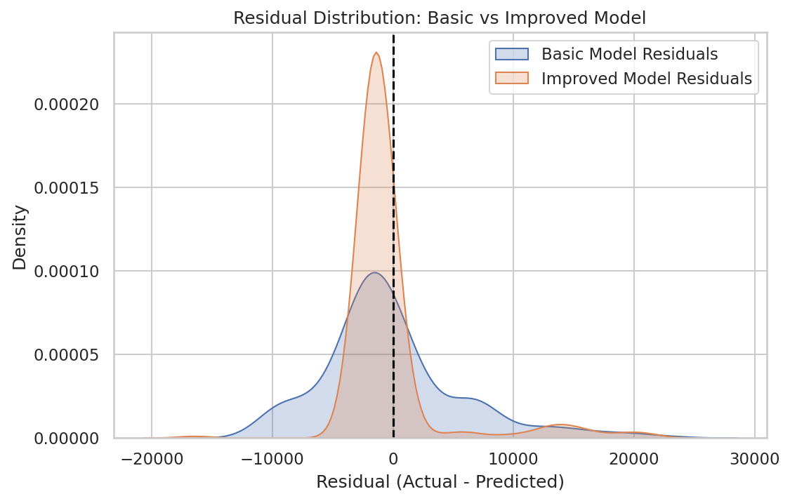

# Medical Insurance Cost Prediction

A machine learning project that predicts individual medical insurance charges based on personal attributes (age, BMI, smoking status, number of children, sex, and region) using **Linear Regression**.

---

## 1. Project Overview

Health insurers price policies based on a person's risk profile. This project builds a regression model that predicts a person's **medical insurance charges** using demographic and lifestyle features, and investigates *why* certain groups (particularly obese smokers) are priced so much higher than others.

**Goal:** Build an interpretable Linear Regression model, diagnose its weaknesses, and improve it through feature engineering (rather than switching to a black-box algorithm), achieving an R² score in the 0.7–0.9 range.

**Key techniques used:**
- Exploratory Data Analysis (EDA)
- Categorical encoding (Label Encoding + One-Hot Encoding)
- Feature engineering (interaction terms)
- Train/test split (80/20)
- Model evaluation (R², MAE, RMSE)
- Residual analysis

---

## 2. Dataset Information

**Source:** [Medical Cost Personal Datasets — Kaggle](https://www.kaggle.com/datasets/mirichoi0218/insurance)

**Rows:** 1,338
**Columns:** 7

| Column | Description |
|---|---|
| `age` | Age of primary beneficiary |
| `sex` | Gender (male/female) |
| `bmi` | Body Mass Index |
| `children` | Number of dependents covered |
| `smoker` | Smoking status (yes/no) |
| `region` | Residential area in the US (northeast, northwest, southeast, southwest) |
| `charges` | **Target variable** — medical insurance cost billed by insurer |

No missing values were present in the dataset.

---

## 3. Environment Setup

**Requirements:** Python 3.9+, Google Colab or Jupyter Notebook

Install dependencies:
```bash
pip install -r requirements.txt
```

**requirements.txt:**
```
pandas==2.2.2
numpy==1.26.4
matplotlib==3.9.0
seaborn==0.13.2
scikit-learn==1.5.0
joblib==1.4.2
```

To run the notebook:
1. Clone this repository
2. Open `notebooks/Medical_Insurance_Cost_Prediction.ipynb` in Google Colab or Jupyter
3. Upload `data/insurance.csv` if running in Colab
4. Run all cells in order

---

## 4. Exploratory Data Analysis (EDA)

### 4.1 Distribution of Charges
The target variable `charges` is **right-skewed** — most policyholders pay under $15,000, while a smaller group pays $40,000+.



### 4.2 Smoker vs Non-Smoker Charges
Smokers pay dramatically more than non-smokers on average — this turned out to be the single strongest predictor in the dataset.



### 4.3 Age vs Charges
Charges increase with age, and the scatter plot clearly separates into two distinct upward bands — smokers form a much higher band than non-smokers.



### 4.4 BMI vs Charges
BMI alone has only a mild effect on charges, but this effect becomes much stronger specifically among smokers — high BMI + smoking is the costliest combination.



### 4.5 Correlation Heatmap
Numeric correlation shows `age` and `bmi` positively correlated with `charges`, but this heatmap alone understates smoking's importance since it only captures numeric columns.



**EDA Summary:**
- Smoking status is the dominant factor affecting charges.
- Age and BMI both increase charges, but their effect compounds sharply when combined with smoking.
- Region and sex have minimal impact on charges.

---

## 5. Feature Engineering

1. **Label Encoding** — applied to `sex` and `smoker` (binary categories: 0/1)
2. **One-Hot Encoding** — applied to `region` (4 categories, no natural order), with `drop_first=True` to avoid the dummy variable trap
3. **Interaction Features** (created after diagnosing model weaknesses):
   - `bmi_smoker` = `bmi` × `smoker` — captures BMI's amplified effect specifically for smokers
   - `is_obese` = 1 if `bmi` ≥ 30, else 0 — flags the medically standard obesity threshold
   - `obese_smoker` = `is_obese` × `smoker` — captures the sharp cost jump for obese smokers specifically, the single most expensive risk group

**Why this mattered:** the base model treated `smoker` and `bmi` as independent, additive effects. In reality, insurers price obese smokers far higher than the sum of the two effects individually. Explicitly engineering this interaction let a linear model capture a non-linear real-world pattern.

---

## 6. Model Training Process

1. **Train/Test Split:** 80% training (1,070 rows), 20% testing (268 rows), `random_state=42` for reproducibility
2. **Baseline Model:** Linear Regression trained on `age, sex, bmi, children, smoker, region_*`
3. **Improved Model:** Linear Regression retrained after adding `bmi_smoker`, `is_obese`, and `obese_smoker`

```python
X_train, X_test, y_train, y_test = train_test_split(X, y, test_size=0.2, random_state=42)
model = LinearRegression()
model.fit(X_train, y_train)
```

---

## 7. Results and Conclusions

### 7.1 Model Performance Comparison

| Metric | Baseline Model | Improved Model | Change |
|---|---|---|---|
| R² Score | 0.7836 | **0.8792** | +0.0956 |
| MAE | $4,181.19 | **$2,378.25** | ↓ ~43% |
| RMSE | $5,796.28 | **$4,330.36** | ↓ ~25% |

### 7.2 Actual vs Predicted Charges (Baseline Model)
The baseline model systematically overpredicted mid-cost smokers and underpredicted the highest-cost obese smokers.



### 7.3 Actual vs Predicted Charges (Improved Model)
After adding interaction features, predictions cluster much more tightly around the ideal diagonal line.



### 7.4 Residual Distribution Comparison
The improved model's residuals (prediction errors) are more tightly centered around zero compared to the baseline model, confirming reduced bias.




### 7.5 Feature Importance (Improved Model)

| Feature | Coefficient | Interpretation |
|---|---|---|
| `obese_smoker` | +15,451.49 | Largest single driver — obese smokers cost dramatically more |
| `smoker` | +1,407.70 | Base smoking effect (remainder after interaction terms absorb most of it) |
| `region_southwest` | -1,381.54 | Slightly cheaper than baseline region |
| `region_southeast` | -768.18 | Slightly cheaper than baseline region |
| `sex` | -556.06 | Minimal effect |
| `children` | +470.63 | Each dependent adds modestly to cost |
| `bmi_smoker` | +464.88 | Additional BMI effect specific to smokers |
| `region_northwest` | -432.58 | Slightly cheaper than baseline region |
| `is_obese` | +326.76 | Small standalone obesity effect (non-smokers) |
| `age` | +262.80 | Each year of age adds modestly to cost |
| `bmi` | -3.37 | Negligible alone — its real effect is captured via interaction terms |

### 7.6 Testing on New, Unseen Data

Five new synthetic profiles were passed to the improved model to sanity-check its real-world reasoning:

| Person | Age | BMI | Smoker | Predicted Charges |
|---|---|---|---|---|
| 1 | 25 | 22.5 | No | $3,985.09 |
| 2 | 45 | 31.2 | No | $10,700.21 |
| 3 | 60 | 28.7 | Yes | $28,374.81 |
| 4 | 30 | 35.8 | Yes | $39,774.00 |
| 5 | 52 | 40.1 | Yes | $46,513.35 |

**Notable finding:** Person 4 (age 30) was predicted to cost *more* than Person 3 (age 60), despite being 30 years younger — because Person 4's obesity + smoking combination outweighs Person 3's age. This confirms the model learned a genuine, real-world risk pattern (obese smokers as the highest-risk group) rather than a simplistic "older = more expensive" rule.

### 7.7 Conclusion

Starting from a baseline Linear Regression model (R² = 0.78), diagnosing a specific weakness (missing smoker × BMI interaction) through residual and scatter plot analysis, and engineering targeted features resolved that weakness and raised performance to R² = 0.88. This demonstrates that model improvement doesn't always require a more complex algorithm — understanding *why* a model is wrong and encoding that domain knowledge as features can be equally effective.

**Limitations & Future Work:**
- Linear Regression still assumes linear relationships within each feature; tree-based models (Random Forest, XGBoost) could capture further non-linearities without manual feature engineering.
- The dataset is US-specific; regional coefficients may not generalize to other countries.
- Further work could include polynomial features for `age` and cross-validation for more robust performance estimates.

---

## 8. Repository Structure

```
medical-insurance-cost-prediction/
├── README.md
├── requirements.txt
├── data/
│   └── insurance.csv
├── notebooks/
│   └── Medical_Insurance_Cost_Prediction.ipynb
├── model/
│   └── insurance_model.pkl
├── images/
│   ├── charges_distribution.png
│   ├── smoker_vs_charges.png
│   ├── age_vs_charges.png
│   ├── bmi_vs_charges.png
│   ├── correlation_heatmap.png
│   ├── actual_vs_predicted_basic.png
│   ├── actual_vs_predicted_improved.png
│   └── residual_comparison.png
└── .gitignore
```

## 9. How to Reproduce

```bash
git clone https://github.com/<your-username>/medical-insurance-cost-prediction.git
cd medical-insurance-cost-prediction
pip install -r requirements.txt
jupyter notebook notebooks/Medical_Insurance_Cost_Prediction.ipynb
```

## 10. Author

Built as a hands-on practice project to learn end-to-end regression workflow: EDA → feature engineering → model training → evaluation → improvement → documentation.
